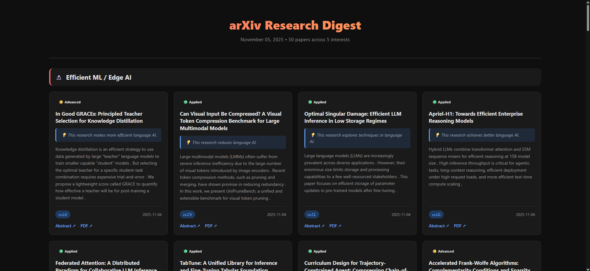

# 📚 Research Digest

**Automated daily research paper digest from arXiv with smart filtering, mobile-friendly interface, and AI-powered summaries.**

Fetch, filter, and browse the latest research papers tailored to your interests. Desktop grid view for deep reading, mobile feed for quick scrolling.

---

## ✨ Features

- **🎯 Smart Filtering** - Keyword-based relevance scoring across custom research interests
- **📱 Mobile Feed** - Swipeable, full-screen card interface optimized for phones
- **🖥️ Desktop Grid** - Multi-column layout with rich metadata and difficulty badges
- **🧠 AI Summaries** - Auto-generated layman explanations using transformers
- **🔄 Deduplication** - Never see the same paper twice with built-in tracking
- **⚙️ Configurable** - JSON-based settings for interests, filters, and preferences
- **📦 Archive** - Auto-saves daily digests with browsable index

---

## 🖼️ Screenshots

### Desktop View


### Mobile Feed


---

## 🚀 Quick Start

### Windows

1. **Clone & Run**
   ```bash
   git clone https://github.com/wedsmoker/research-digest.git
   cd research-digest
   run_digest.bat
   ```

2. **First run automatically:**
   - Creates virtual environment
   - Installs dependencies
   - Fetches papers
   - Generates HTML digests

3. **Open in browser:**
   - `latest.html` - Most recent digest
   - `index.html` - Browse all archives
   - `tiktok_feed.html` - Mobile-optimized feed

### Linux/macOS

```bash
git clone https://github.com/wedsmoker/research-digest.git
cd research-digest
python -m venv venv
source venv/bin/activate  # On Windows: venv\Scripts\activate
pip install -r requirements.txt
python main.py
python generate_index.py
```

---

## ⚙️ Configuration

Edit `config.json` to customize:

```json
{
  "interests": {
    "Your Research Area": {
      "query": "cat:cs.LG OR cat:cs.AI",
      "keywords": ["keyword1", "keyword2", "keyword3"]
    }
  },
  "settings": {
    "papers_per_interest": 10,
    "recent_days": 7,
    "summary_max_length": 160
  }
}
```

### Available Settings

| Setting | Default | Description |
|---------|---------|-------------|
| `papers_per_interest` | 10 | Papers to fetch per category |
| `recent_days` | 7 | Look back window (0 = all time) |
| `fallback_days` | 90 | Extended search if few results |
| `summary_max_length` | 160 | Max characters for summaries |
| `fetch_multiplier` | 5 | Over-fetch for better filtering |

---

## 📖 arXiv Query Syntax

Use arXiv category codes in queries:

- `cat:cs.LG` - Machine Learning
- `cat:cs.CV` - Computer Vision
- `cat:cs.CL` - Computation & Language (NLP)
- `cat:cs.AI` - Artificial Intelligence
- `cat:cs.CR` - Cryptography & Security
- `cat:cs.DC` - Distributed Computing

Combine with `OR`/`AND`: `cat:cs.LG OR cat:cs.AI`

[Full category list](https://arxiv.org/category_taxonomy)

---

## 🔧 Advanced Usage

### Automated Daily Digests & Mobile Sync

**Want automatic daily updates synced to your phone?**
See the [📱 Complete Setup Guide](SETUP_GUIDE.md) for:
- Windows Task Scheduler configuration
- Linux/macOS cron jobs
- Syncthing mobile sync setup
- Troubleshooting tips

### Reset Seen Papers

```bash
python reset_seen_papers.py
```

---

## 📂 Project Structure

```
research-digest/
├── config.json              # Configuration (edit this!)
├── main.py                  # Core paper fetcher
├── generate_index.py        # Archive browser generator
├── generate_tiktok_feed.py  # Mobile feed generator
├── run_digest.bat           # Windows launcher
├── requirements.txt         # Python dependencies
├── latest.html              # Latest digest (auto-generated)
├── index.html               # Archive browser (auto-generated)
├── tiktok_feed.html         # Mobile feed (auto-generated)
├── seen_papers.json         # Deduplication tracker
└── arxiv_archive/           # Daily archives
    ├── arxiv_digest_20251101.html
    └── ...
```

---

## 🛠️ Requirements

- **Python 3.8+**
- **Dependencies:** `transformers`, `torch`, `requests`
- **Disk Space:** ~2GB for model, ~10MB per digest
- **Internet:** Required for arXiv API and first-time model download

---

## 📝 License

MIT License - see [LICENSE](LICENSE) file for details

---

## 🤝 Contributing

Contributions welcome! Ideas:
- Additional paper sources (bioRxiv, SSRN, etc.)
- Browser extension for direct syncing
- Custom ML models for better summaries
- Export to Notion/Obsidian/Roam

---

## 🙏 Acknowledgments

- [arXiv](https://arxiv.org/) for the open research repository
- [Hugging Face](https://huggingface.co/) for transformer models
- Inspired by modern feed UIs and research workflows

---

**Built with ❤️ for researchers who want to stay current without drowning in papers**
